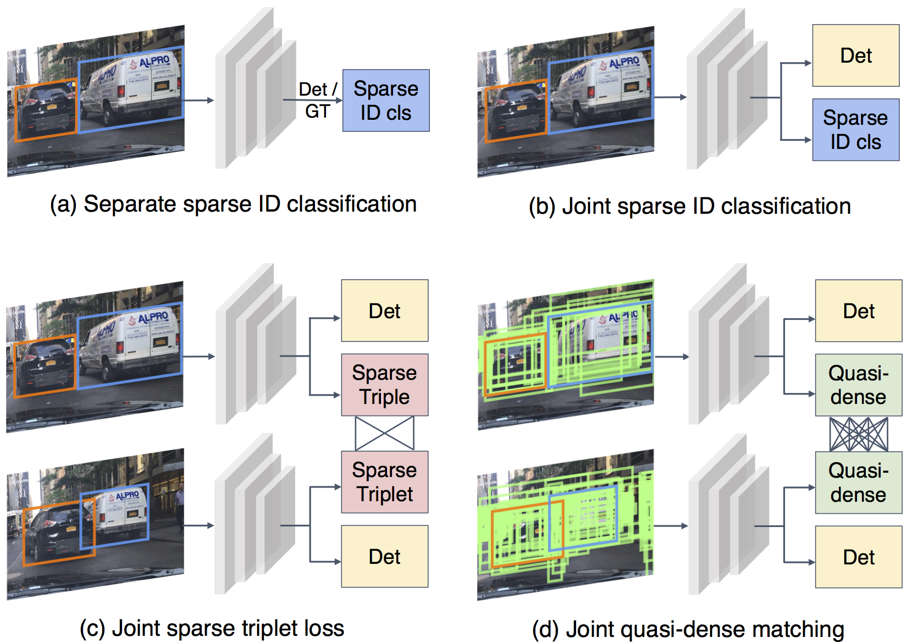

# Quasi-Dense Instance Similarity Learning


We will release the code as soon as we finish the cleaning.

We present a [trailer](https://youtu.be/o8HRJAOZidc) that consists of method illustrations and tracking visualizations. Take a look!


## Abstract

Similarity metrics for instances have drawn much attention, due to their importance for computer vision problems such as object tracking. However, existing methods regard object similarity learning as a post-hoc stage after object detection and only use sparse ground truth matching as the training objective. This process ignores the majority of the regions on the images. In this paper, we present a simple yet effective quasi-dense matching method to learn instance similarity from hundreds of region proposals in a pair of images. In the resulting feature space, a simple nearest neighbor search can distinguish different instances without bells and whistles. When applied to joint object detection and tracking, our method can outperform existing methods without using location or motion heuristics, yielding almost 10 points higher MOTA on BDD100K and Waymo tracking datasets. Our method is also competitive on one-shot object detection, which further shows the effectiveness of quasi-dense matching for category-level metric learning. 


## Quasi-dense matching



<!-- ## Citation -->

<!-- ```
@inproceedings{pang2020quasidense,
  author = {Pang, Jiangmiao and Qiu, Linlu and Chen, Haofeng and Li, Qi and Darrell, Trevor and Yu, Fisher},
  title = {Quasi-Dense Instance Similarity Learning},
  journal={-},
  year={2020}
}
``` -->